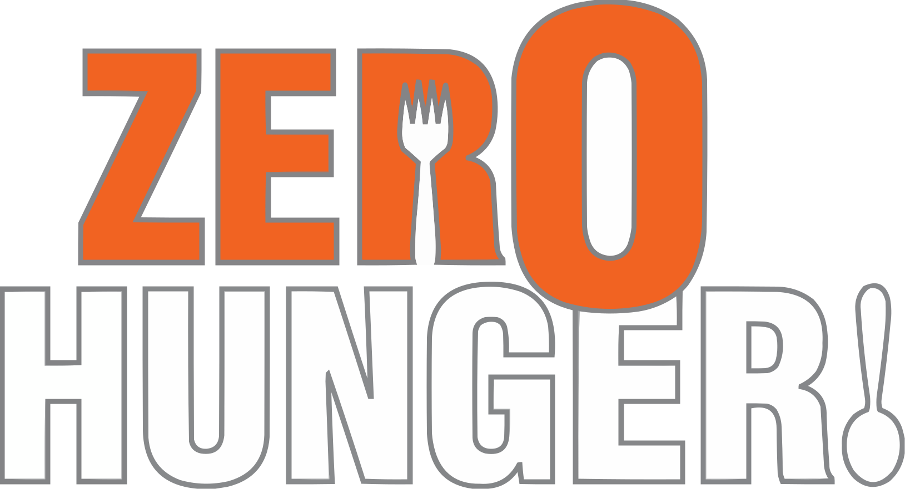
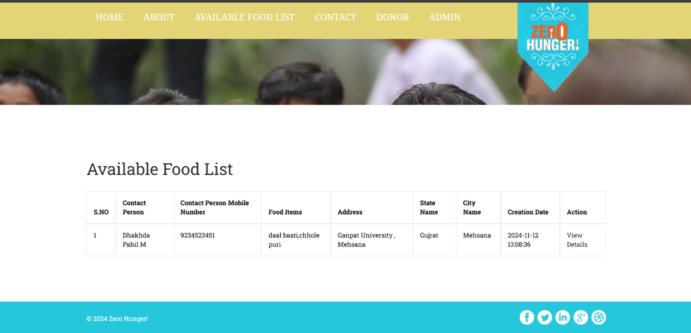
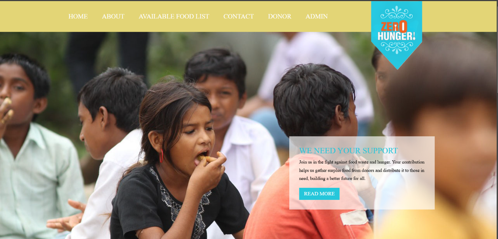
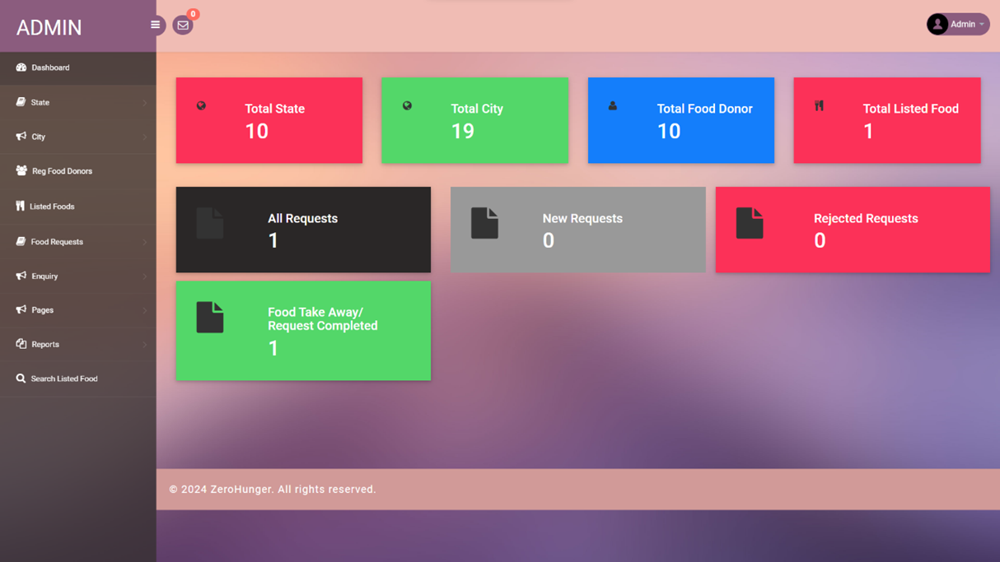
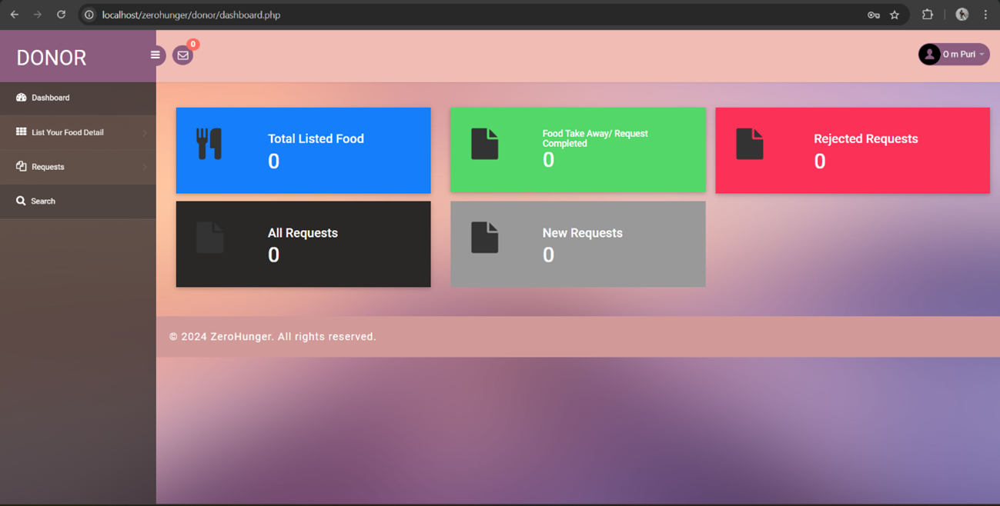

# ✨ Zero Hunger ✨

**Zero Hunger** is a web-based platform built in PHP that bridges the gap between food donors and those in need. This application promotes sustainability by managing food surplus and reducing waste effectively. 🌱🍝

---

## 🔍 Overview

Zero Hunger is a comprehensive system to connect food donors and recipients, aligning with global sustainability goals. The platform provides interfaces for three user roles:

- **🔒 Admin**: Oversees system operations and analytics.  
- **🍵 Donor**: Lists surplus food for donation.  
- **🙋‍♂️ User**: Requests available food donations.

---

## 📊 Technical Specifications

| Specification       | Details                                |  
|---------------------|----------------------------------------|  
| **Language**        | PHP (5.6, 7.x)                        |  
| **Database**        | MySQL 5.x                             |  
| **Frontend**        | HTML, AJAX, JQuery, JavaScript         |  
| **Browsers**        | Chrome, Firefox, Opera, IE8+          |  
| **Server**          | XAMPP / WAMP / MAMP / LAMP            |  

---

## 💡 Features

### 🍲 User Functionality
- **Browse Food**: Explore available donations.  
- **Request Food**: Submit requests for food items.  
- **Contact**: Access contact details for inquiries.    
  

### 📊 Admin Panel
- **Dashboard**: Comprehensive statistics on states, cities, donors, and requests.  
- **Location Management**: Add, update, or delete states and cities.  
- **Donor Management**: Monitor donors and food listings.  
- **Request Management**: Handle requests and generate reports.  

### 🧑‍🌾 Donor Panel
- **Food Listing**: Add surplus food details.  
- **Request Management**: Track and manage user requests.  
- **Search**: Locate specific requests via ID.  

---
